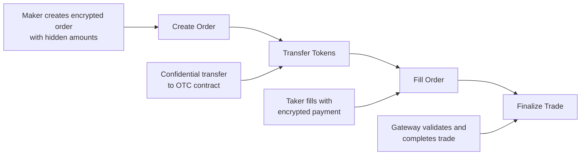
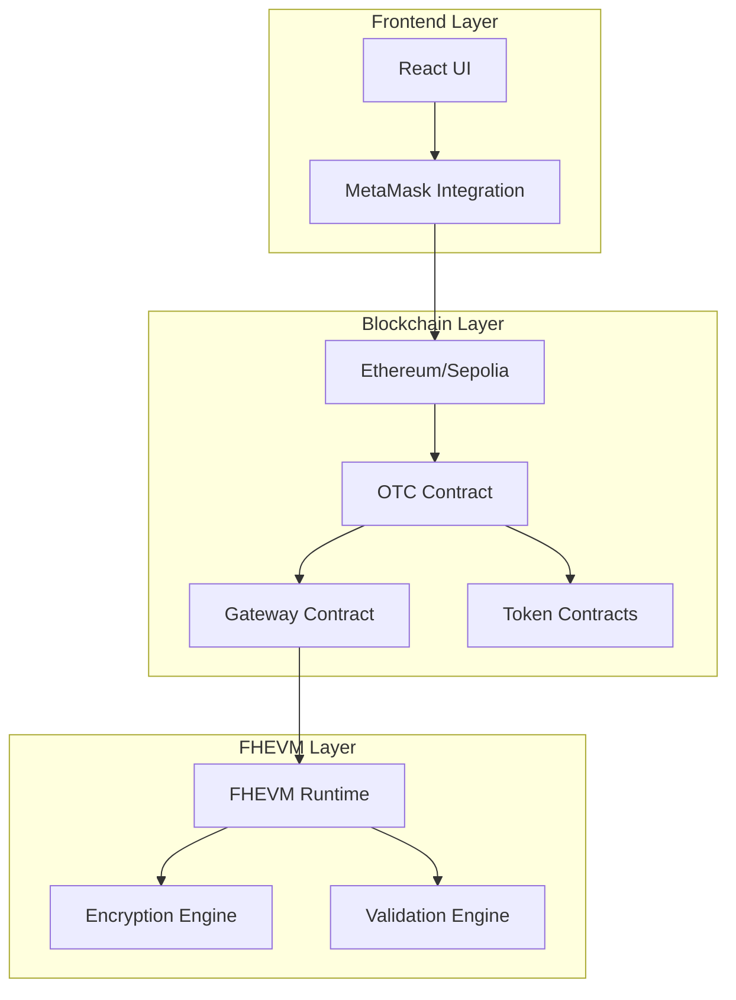

# Confidential OTC Trading with FHEVM

A decentralized confidential trading platform that enables private token exchanges using Fully Homomorphic Encryption Virtual Machine (FHEVM) technology.

## Overview

This project implements a confidential Over-The-Counter (OTC) trading system where trade amounts and participants remain encrypted throughout the entire process. Built on Ethereum with FHEVM integration, it ensures complete privacy while maintaining trustless execution through smart contracts.

## Key Features

- **Complete Privacy**: Trade amounts and participants remain encrypted using FHEVM
- **Trustless Execution**: Smart contracts ensure fair execution without intermediaries
- **High Performance**: Fast confidential computations on Ethereum
- **End-to-End Encryption**: All trade parameters are encrypted from creation to completion
- **Optional Audit**: Post-trade audit capabilities for transparency when needed

## Technical Architecture

### Core Components

1. **OTC Contract**: Main smart contract handling order creation and management
2. **Gateway Contract**: Validates encrypted amounts using homomorphic equality checks
3. **FHEVM Integration**: Enables private computations on encrypted data
4. **Token Contracts**: Standard ERC-20 tokens for trading

### Technology Stack

- **Blockchain**: Ethereum / Sepolia Testnet
- **Encryption**: FHEVM (Fully Homomorphic Encryption Virtual Machine)
- **Frontend**: React with TypeScript
- **Styling**: Tailwind CSS
- **Wallet Integration**: MetaMask
- **Smart Contracts**: Solidity

## How It Works

### Process Flow



### Detailed Steps

#### 1. Create Order
- Maker creates an encrypted order with hidden amounts using FHEVM encryption
- Optional taker address can be specified for private orders
- Order includes token addresses, encrypted amounts, and deadline

#### 2. Confidential Transfer
- Tokens are transferred to the OTC contract using confidential transfers
- Amounts remain private throughout the process
- Contract stores encrypted order data

#### 3. Fill Order
- Taker fills the order with encrypted payment
- Gateway validates encrypted amounts using homomorphic equality checks
- No party can see actual amounts during validation

#### 4. Finalize Trade
- Gateway finalizes the trade after validating encrypted amounts match
- Tokens are distributed to respective parties
- Trade completion is recorded on-chain

## System Architecture



## Security Features

### Encryption
- **Fully Homomorphic Encryption**: Enables computations on encrypted data
- **Zero-Knowledge Proofs**: Transaction integrity without revealing details
- **End-to-End Encryption**: All sensitive data encrypted throughout process

### Smart Contract Security
- **Immutable Execution**: Contract logic cannot be modified after deployment
- **Gateway Validation**: Encrypted amount validation without revealing values
- **Optional Audit**: Post-trade transparency when required

## Getting Started

### Prerequisites

- Node.js 18+
- MetaMask wallet
- Sepolia testnet ETH
- Git

### Installation

1. Clone the repository:
```bash
git clone <repository-url>
cd zama-otc
```

2. Install dependencies:
```bash
npm install
```

3. Start the development server:
```bash
npm run dev
```

4. Open [http://localhost:3000](http://localhost:3000) in your browser

### Configuration

1. Connect MetaMask wallet
2. Switch to Sepolia testnet
3. Ensure you have test ETH for gas fees
4. Mint test tokens for development (available in the UI)

## Usage

### Creating an Order

1. **Connect Wallet**: Use MetaMask to connect to Sepolia testnet
2. **Fill Order Details**:
   - Token In Address
   - Token Out Address
   - Amount In (encrypted)
   - Amount Out (encrypted)
   - Optional Taker Address
   - Deadline (Unix timestamp)
3. **Transfer Option**: Choose whether to transfer tokens immediately
4. **Approve Operator**: If transferring immediately, approve the contract
5. **Create Order**: Submit the encrypted order

### Filling an Order

1. **View Orders**: Click "View All Orders" to see available orders
2. **Select Order**: Choose an order to fill
3. **Provide Payment**: Submit encrypted payment matching the order
4. **Complete Trade**: Gateway validates and finalizes the trade

## Development

### Project Structure

```
packages/
├── site/                 # Frontend application
│   ├── components/       # React components
│   ├── hooks/           # Custom React hooks
│   ├── abi/             # Contract ABIs
│   └── app/             # Next.js app directory
└── contracts/           # Smart contracts (if any)
```

### Key Files

- `components/OTCDemo.tsx`: Main application component
- `components/CreateOrder.tsx`: Order creation form
- `hooks/metamask/useMetaMaskProvider.tsx`: MetaMask integration
- `abi/`: Contract interface definitions

## Testing

The application includes test token minting functionality for development:

1. Use the "Mint Tokens" button to get test tokens
2. Each mint provides 1000 tokens of each type
3. Test tokens are only for development purposes

## Network Support

- **Sepolia Testnet**: Primary test network
- **Localhost**: Hardhat local network for development
- **Mainnet**: Production deployment (when ready)

## Contributing

1. Fork the repository
2. Create a feature branch
3. Make your changes
4. Test thoroughly
5. Submit a pull request

## License

This project is licensed under the MIT License - see the LICENSE file for details.

## Support

For questions and support:
- Create an issue in the repository
- Check the documentation
- Review the code comments

## Roadmap

- [ ] Mainnet deployment
- [ ] Additional token support
- [ ] Advanced order types
- [ ] Mobile wallet integration
- [ ] Enhanced UI/UX features

---

**Note**: This is a demonstration project showcasing FHEVM capabilities for confidential trading. Always verify smart contracts before using with real funds.