# Confidential OTC Escrow

This project implements a **Confidential OTC (Over-The-Counter) Escrow** smart contract that combines:

- **OpenZeppelin Confidential Contracts (ERC-7984)** for confidential token balances and transfers.
- **Zama FHEVM library** for encrypted values (`euint64`, `eaddress`) and confidential operations.
- **Gateway / Relayer SDK** for encrypted input generation, attestations, and finalization of trades.

## 🚀 Deployed Contracts (Sepolia Testnet)

| Contract | Address | Description |
|----------|---------|-------------|
| **ConfidentialOtcEscrow** | [`0x8750304ab739c43e93dDA3950f57D51B5e9FeA3c`](https://sepolia.etherscan.io/address/0x8750304ab739c43e93dDA3950f57D51B5e9FeA3c) | Main OTC trading contract |
| **ConfidentialTokenIn** | [`0x55333a880b14eeCF996799Fd9c91a388af613a61`](https://sepolia.etherscan.io/address/0x55333a880b14eeCF996799Fd9c91a388af613a61) | Input token (ERC-7984) |
| **ConfidentialTokenOut** | [`0x68FfE8fF91f8a2742E37f2D7012a43e19DC797a0`](https://sepolia.etherscan.io/address/0x68FfE8fF91f8a2742E37f2D7012a43e19DC797a0) | Output token (ERC-7984) |
| **Gateway** | `0x8d30010878d95C7EeF78e543Ee2133db846633b8` | Authorized gateway for trade finalization |

**Network**: Sepolia Testnet (Chain ID: 11155111)  
**Deployer**: `0x8d30010878d95C7EeF78e543Ee2133db846633b8`  
**Deployment Block**: 9507457

---

## ✨ Features
- Confidential order creation: maker posts an order with encrypted amountIn, amountOut, and optional allowlisted taker.
- Confidential escrow: tokens are moved into the contract using ERC-7984 `confidentialTransferFrom`.
- Encrypted taker payments: taker pays in using confidential tokens.
- Off-chain equality checks: encrypted equality (`amountIn == takerPay`) is validated by the **Gateway**.
- Gateway finalization: once transfers are valid, the Gateway calls `finalizeFill(...)` on-chain.
- Optional post-trade reveal: maker can choose to make amounts/taker publicly decryptable for audit.

---

## 📜 Architecture

### High-Level Flow
```
Maker                     OTC Escrow Contract                 Taker
 │  createEncryptedInput   │                                   │
 │ ───────────────────────▶│ OrderCreated (encrypted)          │
 │ confidentialTransferOut │                                   │
 │ ───────────────────────▶│                                   │
 │                         │                                   │ createEncryptedInput
 │                         │◀───────────────────────────────── │
 │                         │ FillRequested (takerPay handle)   │
 │                         │                                   │
 │                         ▼                                   │
 │                   FHE Execution Layer / Gateway             │
 │                   - validate attestations                   │
 │                   - check encrypted equality                │
 │                   - transfer confidential balances          │
 │                   - call finalizeFill on-chain              │
 │                                                             │
```

### Detailed Trading Process

```mermaid
graph TD
    A[Maker wants to trade] --> B[Create encrypted inputs]
    B --> C[amountIn, amountOut, taker]
    C --> D[Relayer SDK generates handles]
    D --> E[confidentialTransferFrom]
    E --> F[createOrder on contract]
    F --> G[OrderCreated event emitted]
    
    H[Taker finds order] --> I[Create encrypted payment]
    I --> J[confidentialTransferFrom payment]
    J --> K[fillOrder on contract]
    K --> L[FillRequested event emitted]
    
    L --> M[Gateway receives event]
    M --> N[FHE validation: amountIn == takerPay?]
    N --> O[Confidential transfers]
    O --> P[takerPay → Maker]
    P --> Q[amountOut → Taker]
    Q --> R[finalizeFill on contract]
    R --> S[OrderFinalized event emitted]
    
    T[Optional: Maker reveals terms] --> U[TermsRevealed event]
    U --> V[Public audit available]
```



### Security & Privacy Layers


### Flow
1. Maker encrypts order terms (amountIn, amountOut, optional taker) and escrows `amountOut` tokens.
2. Maker calls `createOrder(...)` with external handles + attestation.
3. Taker encrypts payment (`takerPayEnc`) and calls `fillOrder(...)`.
4. Contract records taker handle, emits `FillRequested`.
5. Gateway validates `amountInEnc == takerPayEnc`, performs confidential transfers:
   - `takerPay` → maker
   - `amountOut` → taker
6. Gateway calls `finalizeFill(orderId, taker)`.
7. Maker may reveal terms post-trade.

---

### Gateway Responsibilities


- **Issue attestations** for encrypted inputs created with the Relayer SDK.
- **Validate ciphertext equality** (e.g., `amountIn == takerPay`).
- **Update confidential balances** in ERC-7984 tokens.
- **Finalize escrow fills** by calling back into the smart contract with `finalizeFill`.

---

## 🛠 Installation

```bash
# install dependencies
npm install --save-dev hardhat @nomiclabs/hardhat-ethers ethers typescript ts-node
npm install @zama-fhe/relayer-sdk @openzeppelin/confidential-contracts
```

---

## 🚀 Deployment (Base network example)

Update `hardhat.config.ts`:
```ts
networks: {
  base: {
    url: process.env.BASE_RPC,
    chainId: 8453,
    accounts: [process.env.DEPLOYER_PRIVATE_KEY]
  },
  baseSepolia: {
    url: process.env.BASE_SEPOLIA_RPC,
    chainId: 84532,
    accounts: [process.env.DEPLOYER_PRIVATE_KEY]
  }
}
```

Deploy:
```bash
npx hardhat run scripts/deploy.ts --network base
```

---

## 🔑 Usage

### Frontend Demo
The easiest way to interact with the deployed contracts is through the React frontend:

```bash
# Start the frontend
cd packages/site
npm run dev
```

Then visit `http://localhost:3000` to:
- Create confidential orders (Maker)
- Fill existing orders (Taker)
- View order history and status
- Reveal terms for auditing

### Programmatic Usage

#### Maker creates order
```ts
const enc = await createEncryptedInput(relayer);
enc.addUint64(amountIn);
enc.addUint64(amountOut);
enc.addAddress(taker);
const { handles, attestation } = enc.build();

await otc.createOrder(
  tokenIn,
  tokenOut,
  handles[0], // amountIn
  handles[1], // amountOut
  handles[2], // taker
  attestation,
  deadline,
  true // doTransferOut
);
```

#### Taker fills order
```ts
const enc = await createEncryptedInput(relayer);
enc.addUint64(payIn);
const { handles, attestation } = enc.build();

await otc.fillOrder(
  orderId,
  handles[0], // takerPay
  attestation,
  true // doTransferIn
);
```

#### Gateway finalizes
```solidity
// Only callable by gateway
function finalizeFill(uint256 id, address taker) external;
```

#### Reveal terms
```solidity
function revealTerms(uint256 id) external;
```

---

## 📊 System Architecture

### Component Overview


### Data Flow


### Security Model


---

## 🧪 Testing the Deployed Contracts

### Quick Test with Frontend
1. **Start the frontend**:
   ```bash
   cd packages/site
   npm run dev
   ```

2. **Connect MetaMask** to Sepolia testnet

3. **Test as Maker**:
   - Create a new order with encrypted amounts
   - Set token addresses (already configured)
   - Submit the order

4. **Test as Taker**:
   - Fill an existing order
   - Enter payment amount (encrypted)
   - Submit the fill request

5. **View Orders**:
   - See all order events
   - Track order status
   - View transaction hashes

### Programmatic Testing
```bash
# Run tests against Sepolia
cd packages/fhevm-hardhat-template
npx hardhat test --network sepolia
```

## 🔒 Security & Privacy Model

### Privacy Protection


### Security Layers


### Risk Mitigation

| Risk | Mitigation | Implementation |
|------|------------|----------------|
| **Privacy Leakage** | FHE Encryption | All amounts encrypted as `euint64` |
| **Invalid Trades** | FHE Validation | Gateway validates `amountIn == takerPay` |
| **Unauthorized Access** | Gateway Control | Only authorized gateway can finalize |
| **Data Tampering** | Attestation | Relayer SDK provides cryptographic proof |
| **Front-running** | Encrypted Orders | Order terms hidden until reveal |

## 🔒 Security Notes
- Never try to `require` encrypted booleans on-chain — comparisons must be validated by the Gateway.
- Ensure the `gateway` address is properly governed (multisig or DAO).
- Always audit before mainnet deployment.
- The current deployment uses the deployer address as gateway for testing purposes.

---

## 📚 References
- [Zama FHEVM](https://docs.zama.ai/fhevm)
- [OpenZeppelin Confidential Contracts](https://docs.openzeppelin.com/confidential-contracts)
- [Sepolia Testnet](https://sepolia.etherscan.io/)

